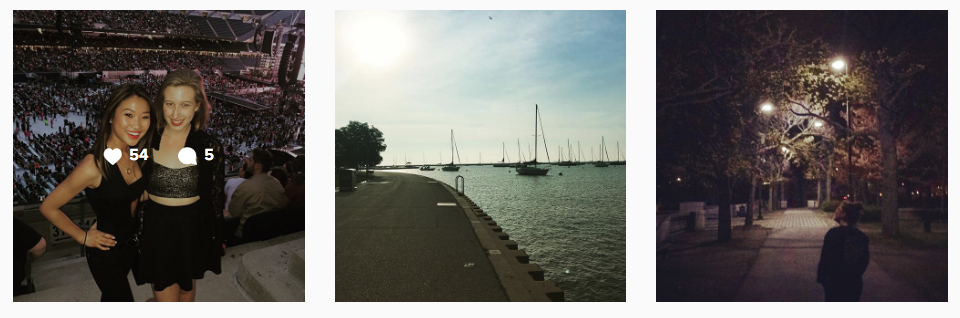
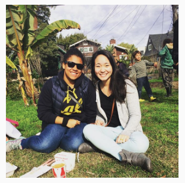

```{r, echo=FALSE, message = FALSE, inclue = FALSE, warning= F}
# Post1: motivation, data collection method, initial observations, t-test results
# bring in data, do initial cleaning
# install packages
library("data.table")
library("ggplot2")

# create working directory path
path_base <- getwd()
folder_name <- "idata"
data <- "data"

# set plot themes
theme_nicole =  theme(
    axis.text = element_text(size = 14),
    legend.key = element_rect(fill = "white"),
    legend.background = element_rect(fill = "white"),
    legend.position = c(0.14, 0.80),
    panel.grid.major = element_blank(),
    panel.grid.minor = element_blank(),
    panel.background = element_rect(fill = "aliceblue")
  )

# bring in data
instaData <- read.csv(paste(path_base, data, 'jun_30_instadata.csv', sep = '/'), sep = ',', header = TRUE)
instaData <- data.table(instaData)


#instaData <- fread(paste(path_base, 'insta_data.txt', sep = '/'), sep = ',', header = TRUE)
#instaData <- readRDS(paste(path_base, folder_name, data, 'jun_30_instadata.RDS', sep = '/'))

# mess with the data
instaData[instaData$day_of_week=='wednesady']$day_of_week <- "wednesday"
instaData[instaData$day_of_week=='tueday']$day_of_week <- "tuesday"
instaData[portrait_v_landscape=='portriat']$portrait_v_landscape <- 'portrait'
instaData$date_number <- as.numeric(substr(instaData$date_posted,4,5))
instaData$month <- as.numeric(substr(instaData$date_posted, 1, 2))
instaPortraits <- instaData[portrait_v_landscape=='portrait']
instaPortraits$nonHumanPortrait <- ifelse(instaPortraits$num_people==0, 1, 0)
# TIMELINE (( think about how to measure variety... lagged variables? ))
# Post1: motivation, data collection method, initial observations, t-test results
# Post2: investigate what sample size does when the sample is same OM as the number of covariates. what sample size do I need?
# Post3: scrape the insta data, talk about whether that was hard, learn more about their apis and why scraping necessary
# (note that to programatically get num people and dummy for account owner in photo, can use photo tags)
# Post4: now that I have more data, I can run regressions!
# Post5: try programatically getting num people and dummy for account owner in photo, talk about how this was done
# Post6: what does it mean for regression results to be causal? Are mine?
# Post7: testing hypotheses and testing for causality: can I run an experiment? How do I get the highest number of likes? How to structure an experiment?
# Post8: scrape Selena Gomez or another account, see if her effects are similar to mine
# Post9: discuss heterogeneity. scrape other popular accounts, see if there are aggregate effects. See if their individual models have different coefficients

# large scale timeline:
# chapter 1: instagram likes
# chapter 2: a new LHS: followers and brand growth (introduce nicoleCat, analytics measurement (google analytics is hard), )
# chapter 3: 

# TITLE: "An exercise in narcisism"
# TITLE: 

# save data
# saveRDS(instaData, paste(path_base, folder_name, data, 'jun_30_instadata.RDS', sep = '/'))

```


Have you ever wondered what makes some instagram photos get a ton of likes, while others can barely hit 10? Why does Selena Gomez have 750 million likes on a photo of her chilling next to a car, while my very best photo of my friend and I at the Beyonce concert maxes out at 50? (I mean obviously she's famous, so there's that.) More importantly, is it possible to figure out what makes an image more 'likeable' and then max out the likability of that photo? Or are humans so confusing and flaky for our tastes to ever be predictable? 



When posting an insta, I'll look at a variety of pictures from the same event, and I'll pick one that represents whatever fun thing I did the best and adds variety to my feed (been posting a lot of selfies lately? I'll post a pic of the friend I hung out with. Tons of group shots? Maybe it's time for a nice landscape photo. Need a buffer between people posts? I'll add the pic of that nicely lit dinner I had last week.) I consider a few main characteristics: the time at which I'm posting (Friday night? good luck getting any likes), the human composition (selfie? group shot? am I in it?), and whether it's a landscape or portrait shot. These, I think, are distinguishing factors of insta posts, which I think will have some effect on the number of likes the post gets. But do they really? Thankfully, I can look at the actual data to find out!

I'll start with the simpler characteristics of the posts themselves, and later on we'll revisit variety effects (e.g. will a selfie do better if it's not preceeded by another selfie?). Now, How ready are you to dive in? (suggested response [courtesy of SNL](http://www.hulu.com/watch/4346): "Sofa King Ready!")

## Data Collection Method

Ok, so here's where things get old school. After messing around with instagrams APIs for an ENTIRE day and not being able to download a ton of data, I decided that doing things the "right" way would take WAY too long, and hell, I just want to do a little poking around to see if any trends hold, so I don't need a ton of high quality data yet. So after work one day I fueled up on 5-Guys cajun fries and decided to - hold on to your hats now - enter data manually. That's right. I split my screen and entered, by hand, the date, time, number of people, and info on whether it was a selfie or a portrait or a landscape for my most recent 60 photos. If you're wondering, it actually only took about an hour, but I do not intend on doing it again any time soon. However, now I've got some data! Here's a glimpse at what it looks like raw:

```{r, echo=FALSE}
head(instaData[, .(date_posted, time_posted, day_of_week, num_people, includes_me, portrait_v_landscape, num_likes)])
```

You'll notice that time posted is a little weird - google sheets loves to inconsistently auto-correct time (ugh). That's going to be super fun to deal with. Otherwise, things are looking pretty good!

## Initial Observations and significance testing

Okay let's get moving! The first thing I want to do is just look at trends in the data. In the end I'll want a predictive model, but let's get our feet wet by testing a few single variable hypotheses before blindly dumping everything into a model. We want to UNDERSTAND the data. FEEL the data. BE the data. OMMMMM.

### Portrait vs Landscape
The first hypothesis is that portrait-style images do better than landscapes. I'm defining as a portrait pretty much anything that is not a landscape photo, so this includes close-ups of fun sidewalk art and the ever so famous food-sta-gram (since I tend to stick with the default square insta's, I won't define these labels by dimensions). We'll go ahead and look at the distributions of number of likes by style in box-plot form, side by side:

```{r, echo=FALSE}
# portraits have higher variance than landscape and maybe higher num likes
# should think about separating people portraits from food portraits
# ggplot(data = instaData, aes(x = portrait_v_landscape, y = num_likes)) + geom_point()
ggplot(instaData, aes(factor(portrait_v_landscape), num_likes)) + geom_boxplot() + xlab('Portrait vs Landscape') + ylab('Number of Likes') + theme_nicole
# var.test(instaData[portrait_v_landscape=='portrait', num_likes], instaData[portrait_v_landscape=='landscape', num_likes])
# qf(0.95, nrow(instaData[portrait_v_landscape=='portrait']), nrow(instaData[portrait_v_landscape=='landscape']))
# # our F is less than the qf score, so we good (our variances are enough the same)
# # http://www.r-bloggers.com/two-sample-students-t-test-1/
# t.test(instaData[portrait_v_landscape=='portrait', num_likes], instaData[portrait_v_landscape=='landscape', num_likes], var.equal=TRUE, paired=FALSE)

# narrower distribution for portrait, but about the same overall
```

Wow. I was totally wrong. Not only are the distribution of number of likes very similar for landscape and portrait posts, if anything the median number of likes for landscapes is HIGHER than that of portraits! This could mean one of a few things:

1. People love landscapes (!)
2. The fact that there are different types of portraits could mean that the distribution we're looking at is an average of two populations that are actually different. What I mean by this is that maybe portraits of people do great, but that photo of the sidewalk I took last week is bringing down the average. In the next section, we'll try to figure out whether this is the case.
3. Maybe these populations are actually indistinguishable. Portraits and Landscapes look the same, so we should stop worrying about it and leave this variable out of the model. 

How do we know whether this could actually be the case? We can determine whether the sample means are statistically different from each other by using a t-test, as long as the right assumptions hold. We're bending the rules here a little bit because ideally we'd like to have random samples of data, and my samples are systematic, including only my most recent posts. We'd also like to know whether the two samples have similar variances, which we can determine with a quick F-test:

```{r}
var.test(instaData[portrait_v_landscape=='portrait', num_likes], instaData[portrait_v_landscape=='landscape', num_likes])
```

The p-value on our F statistic is 0.744, meaning we have no evidence that the variances of our two samples are any different from one another. Great! let's move forward with the t test:

```{r}
t.test(instaData[portrait_v_landscape=='portrait', num_likes], instaData[portrait_v_landscape=='landscape', num_likes], var.equal=TRUE, paired=FALSE)
```

And the winner is number three - the two are indistinguishable! Our t-test results tell us that there's only a whopping 87% chance we would see the means that we do in our samples given that the two populations actually have different means. AKA there's no difference between landscape and portrait pics. 

### Humans like humans 
One thing I'm finding in this analysis is that humans (those other guys liking my posts) like other humans (or at least they like pictures of them). 

#### human portrait vs food portrait
Let's first look at portrait types. Here I'm taking all portraits and splitting them into two categories, those that have zero humans, and those that have one or more. This is testing the difference between a photo like this:
<br>

<br>
and one like this:
<br>

<br>


```{r, echo = FALSE}
# looks like slightly fewer likes for non human portraits,
# way higher variance for human portraits
# ggplot(data = instaPortraits, aes(x = nonHumanPortrait, y = num_likes)) + geom_point()
# yum okay so the mean of human portraits is higher than the 75th pctile of non human portraits
# how do we say if the two means are significantly different? A t-test?? Let's do a t-test in this blog
ggplot(instaPortraits, aes(factor(nonHumanPortrait), num_likes)) + geom_boxplot() + xlab('Portrait of human or not - 0: human, 1:non-human') + ylab('Number of likes') + theme_nicole
```

Portrait posts without humans look like they get fewer likes than those with. I don't find this that surprising. Think about photos you like to look at. Would you rather look back on your facebook photos from 2012 (oh those good old days of college) or the ones you put in that album titled "photography" you made after you spent your entire summer earnings on an SLR? Let's run a quick test to see whether statistics thinks these are different from one another (we'll have to do a Mann-Whitney-Wilcoxon test here since the variances appear to be different - trust for now that this is the right test and we'll come back to this decision in a later post):

```{r, echo = F, warning = F}
# var.test(instaPortraits[nonHumanPortrait==1, num_likes], instaPortraits[nonHumanPortrait==0, num_likes])
wilcox.test(instaPortraits[nonHumanPortrait==1, num_likes], instaPortraits[nonHumanPortrait==0, num_likes])
```

And it looks like statistical significance holds! We know this because our p-value is less than 1%, meaning that there's less than a 1% chance our samples would look as different as they do if in truth they were the same. Damn, we humans sure are nice to look at!

#### Number of people

So this one is kind of interesting. I'm top-coding my data at 5 people (becuase I'm too lazy to count higher than that... deal with it). Feel free to disregard 3-5 now, though, since each of those categories only account for 2-3 posts. 

```{r, echo = FALSE}
# no people has fewer than any other number. Evidence to interace
# num people with portrait to get whether it's a human portrait or not
# ggplot(data = instaData, aes(x = num_people, y = num_likes)) + geom_point()
# not enough obs [3, inf)
ggplot(instaData, aes(factor(num_people), num_likes)) + geom_boxplot() + xlab('Number of People in the Photo') + ylab('Number of likes') + theme_nicole

```

I'm willing to move forward thinking that the result here being that more people is better, but I'd love to return to this once I have more data and see if results hold. I wonder whether, in the pictures with one person, it depends on if I am the one person (#selfie!) or if it's someone else. We'll save that thought for later, since subsetting to single-person photos will pretty severely limit the sample size. I'll also hold off on any significance testing here, again since sample sizes are pretty small once the data are broken down.

#### Am I in it?

Although I can't look JUST at single-image photos, I can subset to images that have some number of people (again, not a sidewalk), and see whether the ones I'm in do better than those I'm not in. 

```{r, echo = F}
# CLEAR TREND NARCISISM: the ones that include me have more likes. Probs
# the only clear relationship I've seen thus far
# ggplot(data = instaData[num_people>0], aes(x = includes_me, y = num_likes)) + geom_point()
# wow yeah these boxes barely overlap
ggplot(instaData[num_people>0], aes(factor(includes_me), num_likes)) + geom_boxplot() + xlab('Includes me - 0: nope, 1:yes!') + ylab('Number of likes') + theme_nicole
```

Guys, this might be the most compelling difference I've seen all day! My followers love photos of me. This is hardly surprising (she says after she has seen the results). My followers follow me! So likely that means they are my friends and they're interested in seeing pictures of me. 

Let's do a quick significance test, just to be sure:

```{r, echo = F, warning = F}
# var.test(instaPortraits[nonHumanPortrait==1, num_likes], instaPortraits[nonHumanPortrait==0, num_likes])
wilcox.test(instaData[num_people>0 & includes_me==1, num_likes], instaData[num_people>0 & includes_me==0, num_likes])
```

And, with a p-value of 0.014, we're significant at the 5% level!

### Timing results are confusing (also, why do I always post on Sundays?)

In addition to characteristics of the photos posted, I have this feeling that the timing of posts is key. Unfortunately, I'm feeling too lazy right now to clean up time of day data, so for a first pass we'll look at days of the week.

```{r, echo=F}
# let's look at number of posts by day of week
day_level <- instaData[, .(num_posts = .N, avg_num_likes = mean(num_likes)), by = day_of_week]
ggplot(day_level, aes(factor(day_of_week), num_posts)) + geom_point() + xlab('Day of the week') + ylab('Number of posts') + theme_nicole
```

Interesting, most of my posts are on weekends, with Mondays and Thursdays not too far behind. What is it about Friday, Tuesday, 
and Wednesday that makes me not want to post? I guess I only got into #throwbackthursday and kind of missed the boat on those other themed days of the week.

Okay, now what about likes? Here are distributions of likes for a given post separated into the day of the week they are posted on.

```{r, echo=F}
# sunday posts maybe have more likes, definitely have higher variance
# ggplot(data = instaData, aes(x = day_of_week,y = num_likes)) + geom_point()
ggplot(instaData, aes(factor(day_of_week), num_likes)) + geom_boxplot() + xlab('Day of the Week') + ylab('Number of likes per post') + theme_nicole
```

It's hard to say there are real differences between the different days of the week. Sunday looks higher than monday, and wednesday looks pretty darn low. This is interesting, because one might think that if I implicitly knew the number of likes I was going to get based on the day of the week, I would stop posting so much on certain days. This clearly isn't the case, though, or I would probably know not to post on a Monday. 

I'd love to know whether these populations are significantly different from each other; however, with so little data and such overlapping medians, I doubt any day will be significantly different from another, especially given the small sample sizes.

As I mentioned before, my time/date data is not amazing and right now I don't feel like finagling with it (let's be real, I'll scrape that POSIX time in like a week so y'all can calm down). I can, however, look at month effects for the first 6 months of 2016 (and so can you!)

```{r, echo=FALSE}
# there is a clear time trend 
# ggplot(data = instaData, aes(x = month, y = num_likes)) + geom_point()
ggplot(instaData[month<10], aes(factor(month), num_likes)) + geom_boxplot() + xlab('Month (number)') + ylab('Number of likes per post') + theme_nicole
# okay maybe a little bit of increase month to month, not extremely clear though. would love to have htem in order...
```

This isn't amazingly telling, but does support the claim that as time goes on, the number of likes I get on posts increases (probably because I'm accruing more followers over time). 

## stay tuned for next time...
Next time we'll talk about scraping data and getting those good, high quality dates. 
After that, we'll think about how to structure our analysis: lots of variables mixed with small sample sizes can make our results seem better than they really are, and we don't want any of that. 
The future also predicts that we'll look at significance and think about further testing and simulating (especially now that our populations will be more complete).


